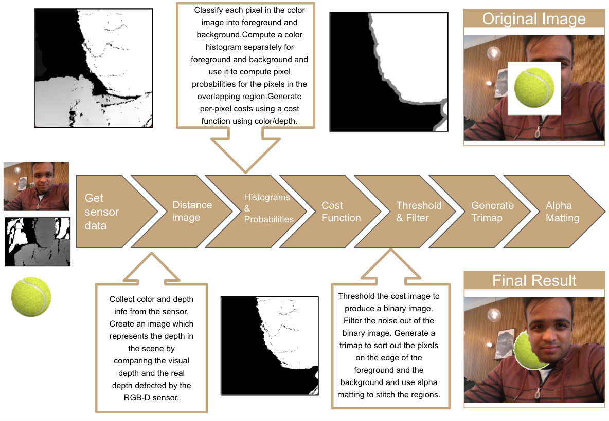

# Depth Based Occulusion

This code implements depth based occulusion as a final project for the CSE 493V course. A high level summary for how the code works can be found be in the following images:

